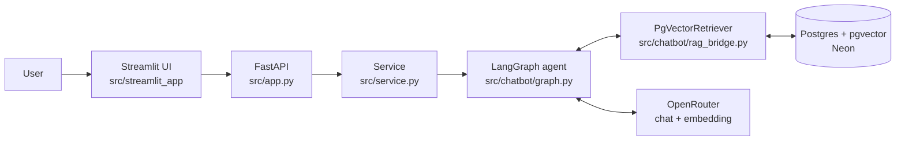
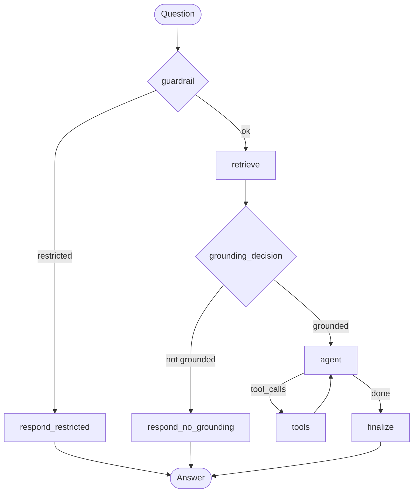

# BotTuyenSinh — Admissions Information Assistant

Admissions chatbot using RAG (pgvector) + a LangGraph agent (native tool-calling via OpenRouter), served through FastAPI with a Streamlit UI.

## Architecture





## Tech stack

- **Backend**: FastAPI, Uvicorn
- **Agent**: LangGraph
- **LLM**: OpenRouter
- **Vector DB**: pgvector (Neon)
- **UI**: Streamlit
- **Test**: pytest
- **Package manager**: uv

## Getting started

Install dependencies:
```
uv sync
```

Configure `.env` (copy from `.env.example`): `DATABASE_URL` (Neon), `OPENAI_API`/`OPENAI_BASE_URL` (chat), `EMBEDDING_API_KEY`/`EMBEDDING_MODEL` (embedding)

Build RAG data (chunk + embed + store in pgvector, one command):
```
uv run python -m src.rag.pipeline --recreate
```

Chunking strategy — pick with `--strategy {structure,sentence,semantic}` (default `structure`):
- **structure** — splits along document structure: heading hierarchy + paragraph/list-item boundaries (`src/rag/chunking.py`). Falls back to line/sentence/word splitting only when a block exceeds `max_chars`.
- **sentence** — splits by sentence instead of paragraph/block, packing consecutive sentences up to `max_chars`.
- **semantic** — embedding-based (no LLM): embeds each sentence via the configured embedding model, cuts where cosine distance between consecutive sentences spikes (95th percentile breakpoint), then packs groups up to `max_chars` (`src/rag/semantic_chunking.py`).

```
uv run python -m src.rag.pipeline --strategy sentence --recreate
```

Run the FastAPI backend:
```
uv run python -m src.app
```

Run the Streamlit UI (backend must already be running):
```
uv run streamlit run src/streamlit_app/app.py
```

Run the chat CLI (no FastAPI/Streamlit needed):
```
uv run python -m src.chatbot
```

Run tests:
```
uv run pytest
```

Test the Postgres/Neon connection:
```
uv run python -m src.db_client
```
